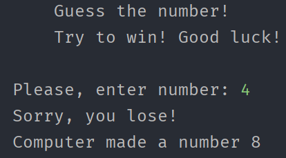

# GuessTheNumber
## What is it?
It's a simple console game where user try to guess the number which computer was randomly chose.

## How to play?
1. Download source code from GitHub
2. Open it in your IDE
3. Run project
4. Enter a number in console

## Demo
